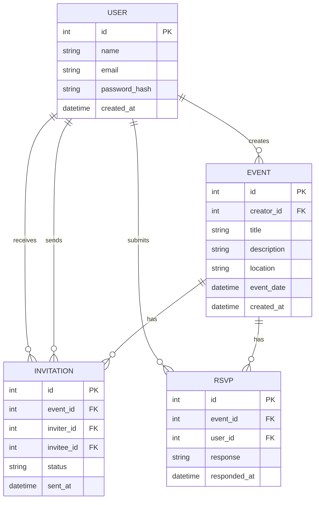

# Database Schema — VividEvents

---

## ER Diagram

<small>Relationships:  
- Users create events  
- Events have many invitations (sent by users to other users)  
- Users RSVP to events  
- Invitations track the sender, receiver, and their status</small>

---

## Description

### Entities and Relationships

**USER:**  
Represents any registered user of VividEvents. Each user can create multiple events, send and receive invitations, and RSVP to events.

**EVENT:**  
Represents an event created by a user. Includes details like title, description, location, and date/time. Each event is associated with one creator (user).

**INVITATION:**  
Tracks invitations sent for a specific event. Each invitation records who invited whom, for which event, at what time, and the status (pending, accepted, declined).

**RSVP:**  
Indicates a user’s response to an event (attending, not attending, maybe). An RSVP is linked to both the event and the user, and records the user’s response and timestamp.

### Example Scenario

Jane (a user) creates a new event, "Art Jam", for next Saturday. She invites her friends Bob and Alice.  
- Two INVITATION records are created: one for Bob, one for Alice, both linked to "Art Jam" and Jane as the inviter.
- Bob RSVPs "attending," and Alice RSVPs "maybe." Two RSVP records are created.
- The app shows Jane how many people are coming based on RSVPs, and Bob & Alice see the event in their calendars.

### Why This Schema?

- **Scalability:** Separating invitations and RSVPs allows for flexible invitation management, tracking, and analytics.
- **Social Features:** Relationships make it easy to count attendees, list them, and manage event privacy.
- **Extensibility:** More entities (comments, reminders, media, etc.) can be added as the app grows.

---

<small>Add more entities and relationships as your project grows.</small>